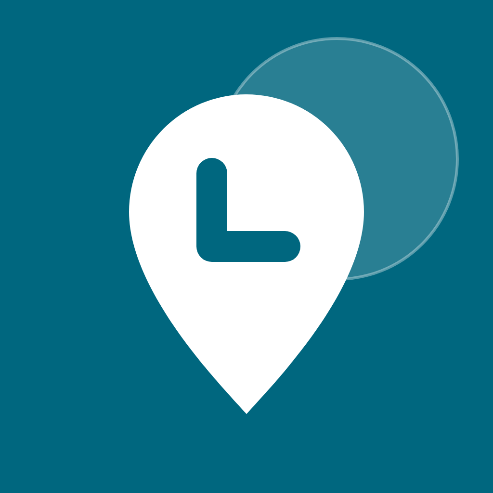

<p align="center"></p>

# Petit Coin · 方便点

Find a public toilet anywhere in France. A Flutter app for iOS and Android with a
Material 3 interface, frosted-glass panels over the map, in 12 languages: English, French, German,
Spanish, Italian, Portuguese, Dutch, Polish, Japanese, Korean and Simplified and
Traditional Chinese.

在法国随时找到最近的公共厕所。Flutter 开发，支持 iOS 和 Android，界面采用
Material 3 加毛玻璃浮层，支持简体中文、繁体中文、英、法、德、西、意、葡、荷、波、日、韩 12 种语言。

## Features

- Map of nearby toilets with filters: open now, free, wheelchair accessible, baby change.
- Details for each toilet: opening hours, walking time, facilities, data source.
- Dynamic color from the wallpaper (Android 12+), or one of eight preset palettes.
- Follows the phone's language; can be changed in Settings.
- Privacy consent on first launch; analytics optional and off by default.
- Data refreshes in the background when the last sync is over 24 hours old.

## Data

Toilet data comes from [OpenStreetMap](https://www.openstreetmap.org/copyright),
merged with city open data (Paris, Lyon, Toulouse, Marseille). During development the
app queries the Overpass API directly. In production a backend will merge the
sources on this cadence (`lib/data/sync_policy.dart`):

| Source | Pulled |
|---|---|
| OpenStreetMap (Geofabrik France extract) | daily |
| Paris open data (in-service status) | daily |
| Other cities | weekly |
| User reports | live, after review |

Map tiles: [OpenFreeMap](https://openfreemap.org), built from OpenStreetMap.

## Development

```sh
flutter pub get
flutter test
flutter run
```

Requires Flutter 3.47 or later. Strings live in `lib/l10n/*.arb`; `flutter gen-l10n`
regenerates them (it also runs on build).

| Path | What |
|---|---|
| `lib/map/` | Map screen and bottom panel |
| `lib/data/` | Toilet model, Overpass loader, filters, opening hours, sync policy |
| `lib/settings/` | Preferences and the settings screen |
| `lib/privacy/` | First-launch consent |
| `lib/theme/` | Material 3 theme and preset palettes |
| `lib/widgets/glass.dart` | Frosted-glass surface |

## License

Code: [Apache License 2.0](LICENSE). Data: [ODbL 1.0](DATA_LICENSE.md).
Privacy policy: [PRIVACY.md](PRIVACY.md).
